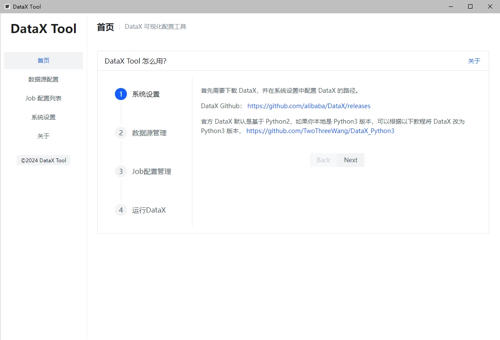

# DataX Tool

## 简介

DataX Tool 是一个可视化配置管理工具客户端，用于简化 DataX 的配置和运行过程。

如果你是一个数据工作者，经常使用 DataX 抽取数据，这个项目可以帮助你可视化的生成 DataX 的配置文件，并且可以一键运行。

基于开源项目 Wails 实现，使用 GO+VUE 语言，目前主要验证了 Windows10 系统下运行正常，理论上支持 Mac、Linux。

## 功能列表

| 功能       | 描述                                |
|----------|-----------------------------------|
| 数据源管理    | 常用数据源收藏夹，新建配置文件时可以快速选择已有的数据源      |
| job 配置管理 | 新增 job 配置，编辑已有的配置文件，一键运行 DataX 任务 |

## 快速开始

1. 下载并解压 [https://github.com/TwoThreeWang/DataX_Tool/releases/](https://github.com/TwoThreeWang/DataX_Tool/releases/)
2. 双击打开
3. 按照软件首页的使用指引，配置并开始使用

## 软件截图

### 首页

### 数据源配置

### Job 列表

### 新增 Job

### json 模式修改 job 文件

### 查看 DataX 运行日志

### 系统设置

## 二次开发

后端使用 go 语言，前端使用 VUE+arco design

前端文件在 frontend 目录下，关于 arco design：[https://arco.design/vue/](https://arco.design/vue/)

打包使用 Wails 工具，关于 Wails：[https://wails.io/zh-Hans/docs/introduction](https://wails.io/zh-Hans/docs/introduction)

## TODO LIST
 
- [ ] 增加 Oracle 数据库支持
- [ ] 增加 PgSql 数据库支持
- [ ] 点击停止运行中的 dataX 任务

## 更新日志

### 1.0.0-Bate

- 初版开发完成，初步实现 csv 和 mysql 数据库的配置需求

